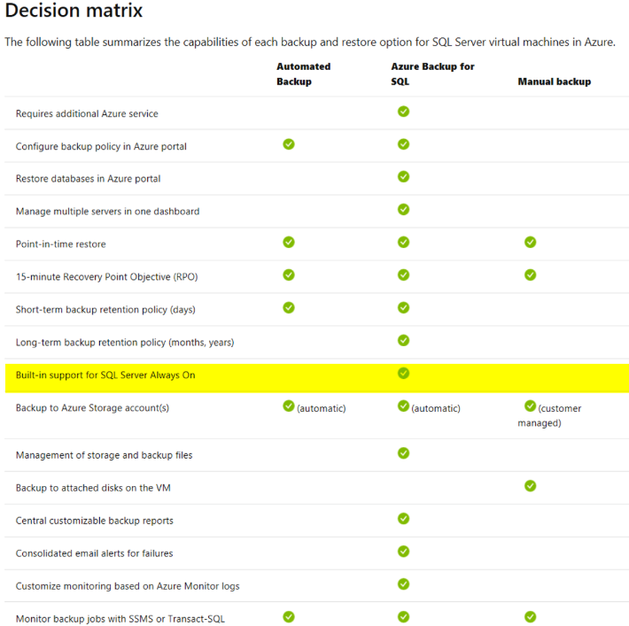

## Background  
Currently Azure Stack Hub's MS-SQL HA deployment uisng **sql-2016-alwayson** ARM template is not supporting the automated backup which is otherwise supported for MS-SQL standalone database as described below.  
  
> [Automated Backup v2 for Azure Virtual Machines](https://docs.microsoft.com/en-us/azure/virtual-machines/windows/sql/virtual-machines-windows-sql-automated-backup-v2)  
  
This instruction works only if the SQL database service has been built using the **standalone** deployment.  

According to the Microsoft support and document, this is by design:  
  
> [Backup & Restore Option for SQL server](https://docs.microsoft.com/en-us/azure/virtual-machines/windows/sql/virtual-machines-windows-sql-backup-recovery#decision-matrix)   
>   
  

  
To resolve this situation, we have two options:  
   A. Use third party backup tool, such as NetBackup agent.  
   B. Use a PowerShell script and run it using Ansible.  

In this ReadMe article, option B is described.  
  

  
## Prerequisites  
- Ansible server
  In this ReadMe article, Ansible on Ubuntu 18 LTS is used.

- Windows Remote Manager (WinRM) on Windows hosts
  Ansible will use WinRM to connect MS-SQL Servers.      
  

    
## Solution summary
We will run though these steps below:  
1. Create a blob storage in Azure Stack Hub.
2. Add Ansible service account to MS-SQL server as sysadmin.
3. Setup an SQL credential and PowerSell SQLHA database backup script.
4. Setup Ansible hosts and a yml playbook for SQL HA database backup.  
  

    
### 1. Create a blob storage account in Azure Stack Hub  
1 Create a storage account  
- Login to the Azure Stack Hub's user portal, and click **"+ Create a resource"** icon and select **"Storage account - blob, file, table, queue"**.  
- Fill up the necessary information and click **Create** to create an account. 
  
2 Create a blob container  
- Navigate to **Storage accouts > "storage_account_name" > Blob**, and click **"+ Container"**.  
- Fill up the information and click OK to create. 
  
3 Take a note of storage account access key  
- Navigate to **Storage accounts > "storage_account_name" > Access keys**, and get your storage accout's **Key**.  
  Note: Store the key somewhere safe.

4 Take a note of Primary blob service endpoint  
- Navigate to **Storage accounts > "storage_account_name" > Properties** , and get your storage accout's endpoint.  

  

### 2. Add Ansible service account to MS-SQL server as sysadmin
Login to the Windows machine and launch up MS SQL Server Management Studio:  
1 Navigate to**Security > Logins**, right click and **New login**.  

2 In the **General** tab, Enter the service account name that had been created in the previous step as a **Login name**.  
   
3 Set **sysadmin** in the **Server Roles** tab.  
 
4 Check **Connect SQL for sa** is Granted in the **Securables** tab.

5 Click OK to close, and log off from MSSMS.  

[Note]  
- If you don't like to give an sa permission to the ansible user, modify the permission as required. (This particular user should be visible to the all databases under this SQL host server as it will search and backup them all. )  
  
  
  
### 3. Setup an SQL credential and PowerSell SQLHA database backup script  
1 Create a credential 
On the MS-SQL HA server hosts, Run the script below:  

```powershell
#==========
#Create cred:
#==========
# load the sqlps module
import-module sqlps 

#set parameters
$sqlPath = "sqlserver:\sql\$($env:COMPUTERNAME)"
$storageAccount = "<storage_account_name>" 
$storageKey = "<storage_account_key>" 
$secureString = ConvertTo-SecureString $storageKey -AsPlainText -Force 
$credentialName = "BackupCredential-$(Get-Random)"

Write-Host "Generate credential: " $credentialName

#cd to sql server and get instances 
cd $sqlPath
$instances = Get-ChildItem

#loop through instances and create a SQL credential, output any errors
foreach ($instance in $instances) {
try {
    $path = "$($sqlPath)\$($instance.DisplayName)\credentials"
     New-SqlCredential -Name $credentialName -Identity $storageAccount -Secret $secureString -Path $path -ea Stop | Out-Null
     Write-Host "...generated credential $($path)\$($credentialName)." }
catch { Write-Host $_.Exception.Message } }

```  
This script will generate an sql backup credential, and keep that **"BackupCredential-xxxx"** value somewhere safe.  


2 Setup sql database backup script
On the MS-SQL HA server hosts, Run the script below:

databaseBackup.ps1:
```powershell

#==========
#Run backup
#==========
import-module sqlps

$sqlPath = "sqlserver:\sql\$($env:COMPUTERNAME)"
$storageAccount = "<your storage accout name>" 
$blobContainer = "<your container name>" 
$backupUrlContainer = "https://<primary endpoint URL>/$blobContainer/" 
$credentialName = "BackupCredential-<backup cred number>"

Write-Host "Backup database: " $backupUrlContainer

cd $sqlPath
$instances = Get-ChildItem

#loop through instances and backup all databases (excluding tempdb and model)
foreach ($instance in $instances) {
$path = "$($sqlPath)\$($instance.DisplayName)\databases"
$databases = Get-ChildItem -Force -Path $path | Where-object {$_.name -ne "tempdb" -and $_.name -ne "model"}

foreach ($database in $databases) {
    try {
        $databasePath = "$($path)\$($database.Name)"
        Write-Host "...starting backup: " $databasePath
        Backup-SqlDatabase -Database $database.Name -Path $path -BackupContainer $backupUrlContainer -SqlCredential $credentialName -Compression On
        Write-Host "...backup complete." }
    catch { Write-Host $_.Exception.Message } } }

```
This script will backup all databases except "tempdb" and "model" databsaes.  
    
**After running the backup script, check if all sql databases have been saved to your blob storage in the Azure Stack Hub.**


### 4. Setup Ansible hosts and a yml playbook for MS-SQL HA database backup
1 On your Ansible server, Edit an Ansible hosts inventory file for your MS SQL HA servers.  
  
```bash

sudo vi  /etc/ansible/hosts

```  
  
And add host group  and variables like example below:  
```bash

[windatabase]
<your windows server FQDN or IP 1>  
<your windows server FQDN or IP 2>

[winhadev:vars]
ansible_user=<Ansible_service_account_name>
ansible_password=<Ansible_service_account_password>
aible_winrm_port=5986
ansible_connection=winrm
ansible_winrm_transport=credssp
ansible_winrm_server_cert_validation=ignore
#If the target server is Windows 2008, un-comment below:
#ansible_winrm_credssp_disable_tlsv1_2=True

```
**wq!** to save.  
 
[Note]  
-**ansible_user** & **ansible_password** are the ones that you have created for your Ansible automation.
-For Prod environment, use **[Ansible Vault](https://docs.ansible.com/ansible/latest/user_guide/vault.html)**.


2 Create an ansilbe play-book for MS-SQL database backup script.  
In your home directory on the ansible server, create a playbook.

sqlDBAutoBackup.yml:
```bash

sudo vi sqlDBAutoBackup.yml

```  
...and add these lines:  

```yml

- name: Powershell sqldatabase backup for Windows MS-SQL server
  hosts: windatabase
  gather_facts: false

  vars:
   ansible_user: "<Ansible_service_account_name>"
   ansible_password: "<Ansible_service_account_password>"

  tasks:
   - win_command: powershell.exe
     args:
      stdin: c:\scripts\databaseBackup.ps1

```  
**wq!** to save.  
   
[Note]  
-**stdin** value would be a full path of your backup script that you have created at the step 3-2 (databaseBackup.ps1).  
  

  
3 Run the play-book.
```bash

sudo ansible-playbook ~/sqlDBAutoBackup.yml -vvvv

```  
**"-vvvv"** is a debug mode switch.  
  
You should see something like this output example:
```python

.
.
.
changed: ["your.database.server.fqdn"] => {
    "changed": true,
    "cmd": "powershell.exe",
    "delta": "0:00:04.486775",
    "end": "2020-01-30 11:15:08.383613",
    "rc": 0,
    "start": "2020-01-30 11:15:03.896837",
    "stderr": "",
    "stderr_lines": [],
    "stdout": "Windows PowerShell \r\nCopyright (C) 2016 Microsoft Corporation. All rights reserved.\r\n\r\nPS C:\\Users\\ansible01admin> c:\\scripts\\databaseBackup.ps1\r\nBackup database:  https://your.database.server.fqdn/backupcontainer/\n...starting backup:  sqlserver:\\sql\\DATABASE_HOST\\DEFAULT\\databases\\AutoHa-sample-dev\n...backup complete.\n...starting backup:  sqlserver:\\sql\\DATABASE_HOST\\DEFAULT\\databases\\master\n...backup complete.\n...starting backup:  sqlserver:\\sql\\DATABASE_HOST\\DEFAULT\\databases\\msdb\n...backup complete.\nPS SQLSERVER:\\sql\\DATABASE_HOST> ",
    "stdout_lines": [
        "Windows PowerShell ",
        "Copyright (C) 2016 Microsoft Corporation. All rights reserved.",
        "",
        "PS C:\\Users\\ansible01admin> c:\\scripts\\databaseBackup.ps1",
        "Backup database:  https://your.database.server.fqdn/backupcontainer/",
        "...starting backup:  sqlserver:\\sql\\DATABASE_HOST\\DEFAULT\\databases\\AutoHa-sample-dev",
        "...backup complete.",
        "...starting backup:  sqlserver:\\sql\\DATABASE_HOST\\DEFAULT\\databases\\master",
        "...backup complete.",
        "...starting backup:  sqlserver:\\sql\\DATABASE_HOST\\DEFAULT\\databases\\msdb",
        "...backup complete.",
        "PS SQLSERVER:\\sql\\DATABASE_HOST> "
    ]
}
META: ran handlers
META: ran handlers

PLAY RECAP ************************************************************************************************************************
your.database.server.fqdn : ok=1    changed=1    unreachable=0    failed=0    skipped=0    rescued=0    ignored=0
.
.

```

[Note]  
- You can check what databases were backup to where in this output.
- In the **PLAY RECAP **, **ok=1** should appear if the run was successful.
- Also check if databases are existed in the blob container on the Azure Stack Hub.  
  

 
4 Set up a cron job (optional) 
To run this yaml playbook in schedule, Add an entry to Ansible user's crontab.

```bash

sudo crontab -u <Ansible_service_account_name> -e

```  
  
The below entry will backup sql databases in every 6 hours:

```bash

#Run ansible playbook under the user "Ansible_service_account_name".
0 */6 * * * sudo ansible-playbook /home/<Ansible_service_account_name>/sqlDBAutoBackup.yml

```  
"wq!" to save the crontab.  
  
Wait and see if this scheduled yml will backup the databases as expected.  
  
--END