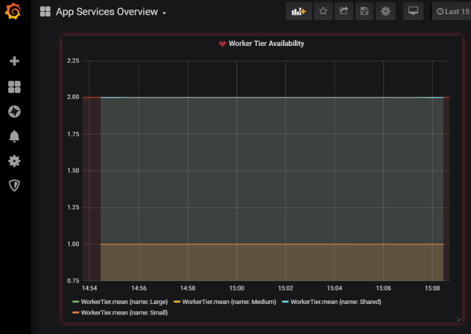
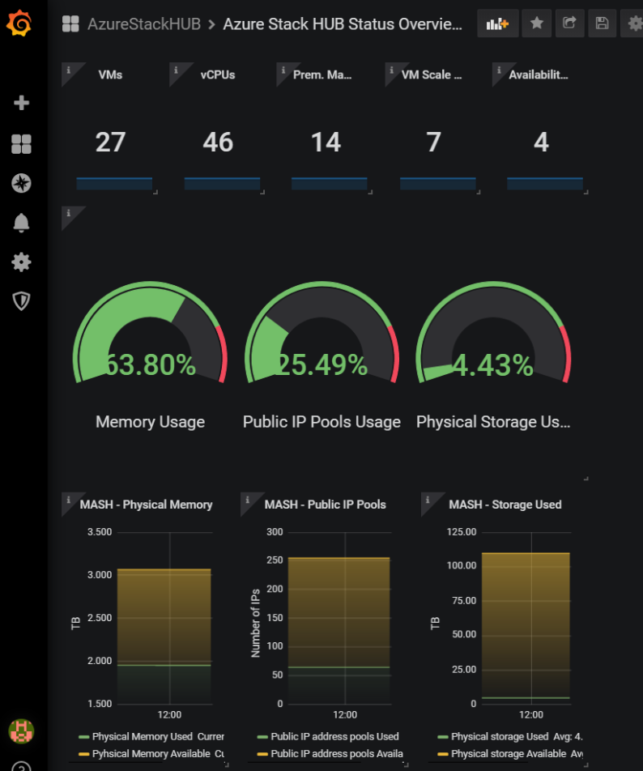

## Background

To have a flexibility creating a performance graph for tennant VMs, PasS Services (such as MS SQL, App services) or AzureStackHUB's health status. IOTStack (Grafana-InfluxDB-NodeRed) and Naigos XI integration has been setup.  

This integration would also be more useful when a second AzureStackHUB is stood up. Using this solution, it can be easily presented both AzureStackHUB1 and 2's status into a one dashboard.  
  

### Integration Environment

For Grafana, NodeRed and InfluxDB, we installed Portainer (Docker container management software) on AzureStackHUB's Linux VM, and imported those apps' container on it. It had been done by [IOTStack](https://github.com/gcgarner/IOTstack).  


#### Prerequisites

Two Linux VMs. In this article, they had been deployed on Azure Stack Hub. 

- IOTStack - Portainer server
  - hostname : iotstack.example.com
  - OS : Linux (Ubuntu 18.04)
  - Size : Standard DS2 v2 (2 vcpus, 7 GB memory, 32 GB OS Disk)  
  - Opened Inbound ports : 22, 80, 443, 1880(NodeRed), 3000(Grafana), 8086(InfluxDB) and 9000(Portainer)

- Nagios XI server
  - hostname : nagiosxi.example.com
  - OS : Linux (Ubuntu 18.04)
  - Size : Standard DS2 v2 (2 vcpus, 7 GB memory, 32 GB OS Disk)  
  - Opened Inbound ports : 22, 80, 443, 5693(NCPA), 3000(Grafana)
  - Nagios XI 5.6
    - [Install PNP components](https://support.nagios.com/kb/article/nagios-xi-using-grafana-with-existing-performance-data-805.html) 


### IOTStack - Portainer Installation  

Login to IOTStack's VM and run the followings.

1: Install Git and clone IOTStack repo

```console
sudo apt install git -y
sudo git clone https://github.com/gcgarner/IOTstack.git azshub-monitorstack #<-your repo name
```  

2: Install Docker and create container's compose yml (using IOTStack)


```console
cd azshub-monitorstack  
sudo ./menu.sh  
```

In the menu, Select **`Build Stack`** and select these:

- Portainer
- Node-RED  
- InfluxDB  
- Grafana  
  
Select **`OK`** and Select **`influxdb`** node for Node-Red:

- node-red-contrib-influxdb
- node-red-contrib-splitter  
- node-red-contrib-flow-combine  
- node-red-contrib-parallel-iterator  
- node-red-contrib-wait-paths  
- node-red-dashboard  
- node-red-node-rbe  
- node-red-node-tail  
  
You can install these **palette** after the container installation. (through NodeRed's Web GUI)  
  
Select **OK** to install. (Server will be rebooted.)  

After the reboot, check if **`docker-compose.yml`** has been created under the repo directory (azshub-monitorstack) and see if your selected containers are described within that yml file.  

3: Install container  

```console
sudo docker-compose up -d
```  

If you see the warning like below:

```console
WARNING: Image for service nodered was built because it did not already exist. To rebuild this image you must use `docker-compose build` or `docker-compose up --build`.  
```  

Run **`docker-compose build`** as the message is saying.  


4: Login to Portainer and Grafana's Web Consoles and create an admin users:  

Login to URLs below  

```http
http://iotstack.example.com:9000/   #Portainer

http://iotstack.example.com:3000/   #Grafana  

```  


5: Setup basic authentication for NodeRed
Install **`npm`** and **`node-red-admin`** on **itostack.example.com**:

```console
sudo apt-get install npm
sudo npm install -g node-red-admin
```  

Setup admin URL:  

```console  
sudo node-red-admin target http://iotstack.example.com:1880/
sudo node-red-admin hash-pw    #Enter admin's password and keep hashed strings in somewhere.
sudo node-red-admin login      #Enter user(admin) and password.
```  

On **itostack.example.com**, edit **`settings.js`**:  

```console
sudo vi /home/<iotstackUser>/azshub-monitorstack/volumes/nodered/data/settings.js  
```  

Uncomment below lines:  

```javascript
  
    adminAuth: {
    type: "credentials",
    users: [{
        username: "admin",
        password: "<hashed password>.",
        permissions: "*"
    }]
},

```

**password** should be the hashed strings you got in the previous step.  
  
Recycle the container (you can do it through Potainer's Web Console) and login to the NodeRed web console to check.  
  

### NodeRed configuration

1: Creating database for azshubmonitor

```console
sudo curl -i -XPOST http://iotstack.example.com:8086/query --data-urlencode "q=CREATE DATABASE azshmonitorprod"  
```

**`200 OK`** message should be appeared if successful.  

From Portainer, Connect to InfluxDB console, and navigate to  
**Containers > influxdb > Console** and run below:

```console
influx
```  

Check database:  

```console
> show databases
```   

You should see **azshmonitorprod**.

2: Import example flows to the NodeRed  
Get example flows from **templates** folder of this repo.

Copy those examples (json format), and login to the NodeRed:

```http
http://iotstack.example.com:1880/
```

Navigate to **`Top right corner's three line icon`** > **`Import`**, and past the json strings, then click **Import** to save. 


3: Edit the flow's database settings

- On the flow editor pane, double click on the **'save to Influxdb'** object in the flow.  
- On the **Server** field, select **`Add new influxdb`** and click the pencil icon to edit.
- Enter IP address, database name you created (azshmonitorprod), and a new name for this entry. (db User and Password are null by default)
- For getAuthTokenFlow, you need to replace **`client_secret=<secret>`** in this flow. (Secret will be stored in safe place)  
    
Click **Deploy** button (Top-right corner) to apply.  
  
  
### Grafana configuration

1: Login: 
Login to Grafana's WebConsole (http://iotstack.example.com:3000/login).
Enter the default user name (admin) and password (admin) for your first login.  
  
2: Add data source:
Navigate to **Configuration > Data sources** in the left pane, and click **Add data source** button on the top-right of the page, and then select **InfluxDB** as a new data souce.  
 
In the **Data Sources / InfluxDB** page, enter followings:  

- Name : **<your data source name>**  
- URL : **http://(InfluxDB container IP):8086** (IP can be checked in the Portainer)
- Database : **azsmonitorprod** (the one you have created using curl in the previous step)  
- HTTP Method : Set to **"GET"**  

Click **"Save & Test"** button to save. You should see a success message.  

  
### Import Dashboard

Now you can create your own dashboard in Grafana.
Examples of dashboard:  

  
  
  

-- End